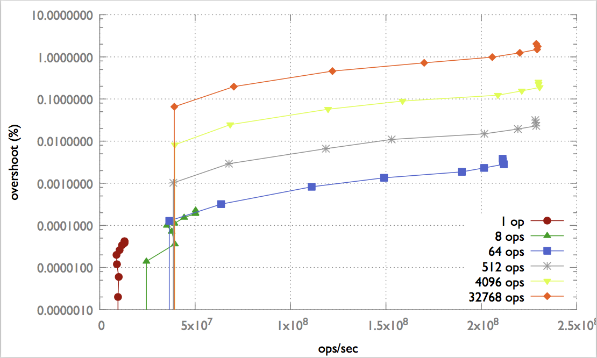
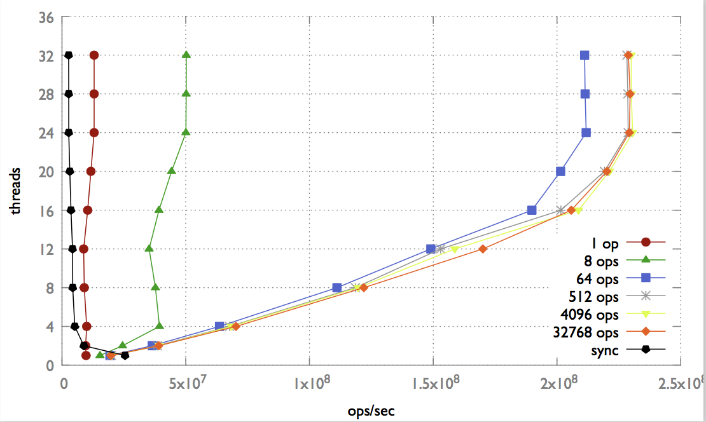
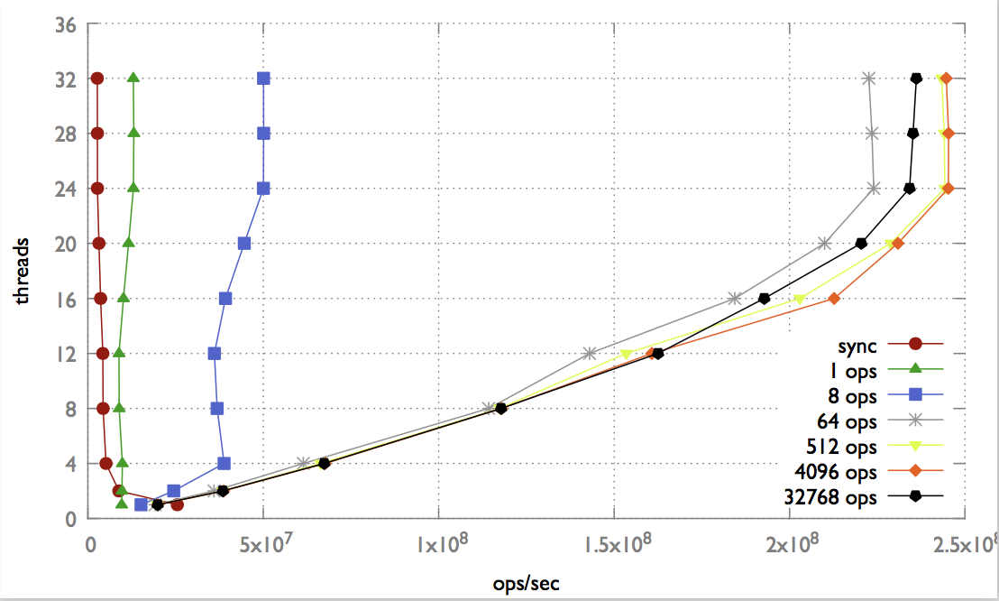

# Mergeable Data Types(MDTs) for shared memory
MDTs for shared memory c++ implementation

# Setup:

### 1 - CLANG++

Make sure that you have clang++ installed with compatibility with c++14 mode.

### 2 - BOOST

Boost is required in order to use Boost.Thread library [Boost.Thread library](https://www.boost.org/doc/libs/1_67_0/doc/html/thread.html). 
This way we can have **thread local** variables as instance variables. [Standard c++ implementation](http://en.cppreference.com/w/c/thread/thread_local) doesn't allow this.

MAC OS:

`brew install boost`

OR:

Download binaries at https://www.boost.org/users/download/

# Build:

Synchronous Counter: `make syncCounter`

Mergeable Counter: `make agreggationCounterAtomic`

Hybrid Mergeable Counter: `make agreggationCounterAtomicHybrid`

OR:
`make all`

# Execution:

Therparameters passed to the executable: **THREADS** represents the number of threads to benchmark.

Our benchmarks will run 10 times for each synchronzation frequency(if applicable) with the respective number of threads and output the average results. 

The synchronization frequency is the interval of operations on which each thread performs a merge.

The results are collected on .txt files on the folder `output`.

## Benchmark examples

**Synchronous Counter**

`make benchSyncCounter THREADS="1 2 4 8 12 16 20 24 28 32"`

**Mergeable Counter**

`make benchAgreggationCounterAtomic THREADS="1 2 4 8 12 16 20 24 28 32"`

**Hybrid Mergeable Counter**

`make benchAgreggationCounterAtomicHybrid THREADS="1 2 4 8 12 16 20 24 28 32"`

## Benchmark all:

`make benchAll THREADS="1 2 4 8 12 16 20 24 28 32"` 

Runs all the benchmarks sequentially. 

# Plotting:

## Setup

Make sure you have gnuplot installed with cairo.

`brew install gnuplot --with-cairo`

Or:
http://www.gnuplot.info/download.html

On `plots` folder you have a config to generate each of the graphs.

## Examples:

### Mergeable Counter graph with the overshoot:


On `plots/mergeable_overshoot` folder run:

`gnuplot -e 'outputname="meageable_overshoot.pdf"; inputnames="1 8 64 512 4096 32768"; titles="1_op 8_ops 64_ops 512_ops 4096_ops 32768_ops"' config.gnuplot ; open meageable_overshoot.pdf`

Where inputnames are the output of the respective benchmarks separated by synchronization frequency. The output will be `meageable_overshoot.pdf`.

Sync freq 64 operations sample:
```
19363883,0.000000,1
36447426,0.000128,2
63634416,0.000320,4
111119846,0.000824,8
149017884,0.001346,12
189849672,0.001862,16
201469040,0.002312,20
211815160,0.002822,24
211363347,0.003328,28
211172892,0.003826,32
````

Each line is a tuple with `(throughput, overshoot percentage, thread number)`

### Mergeable Counter vs Sync Counter:



On `plots/mergeable_vs_sync` Run:

`gnuplot -e 'outputname="mergeable_vs_sync.pdf"; inputnames="1 8 64 512 4096 32768 sync"; titles="1_op 8_ops 64_ops 512_ops 4096_ops 32768_ops sync"' config.gnuplot ; open mergeable_vs_sync.pdf`

In this case we each input file also represents a synchronization frequency (with the addition of sync counter) and will only need the number of operations/sec and thread number information:

```
15359340,1
24454320,2
39376889,4
37756240,8
...
```

### Hybrid Mergeable Counter vs Sync Counter:



Simillarly on `plots/hybrid_vs_sync` run:

`gnuplot -e 'outputname="hybrid_vs_sync.pdf"; inputnames="1 8 64 512 4096 32768 sync"; titles="1_op 8_ops 64_ops 512_ops 4096_ops 32768_ops sync"' config.gnuplot ; open hybrid_vs_sync.pdf`

